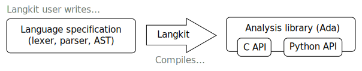

************
Introduction
************

Langkit is a tool whose purpose is to ease the development of libraries to
analyze program source files.  It makes it super-easy to create combined
lexers, parsers and semantics analyzers as libraries which have C, Ada and
Python bindings.

Architecture
============

Langkit is a kind of compiler:

    * Its users are expected to write a language specification. This is a
      Python package that uses the ``langkit`` package to define a lexer, a
      parser and the structure of the AST that the parser will instantiate.

    * Langkit compiler this specification into an analysis library in Ada with
      C and Python bindings.

    * The generated library can be shipped to programmers that intend to write
      analysis tools such as code editors, code checkers, etc. These will not
      be aware of Langkit at all.

